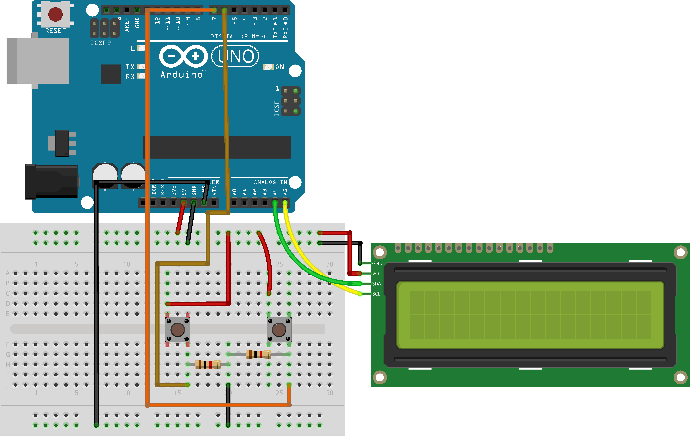

 
 

````markdown
# FunDruino #02: **Pixel Snake** on a 16x2 LCD 🐍

**Pixel Snake** is the second edition of **FunDruino** — a playful Arduino project series that combines electronics, programming, and creativity.  

In this project, I recreated the classic **Snake Game** on a **16x2 I2C LCD** using **Arduino Uno**. Even with limited hardware, it demonstrates interactive applications using:

- Custom LCD characters  
- Efficient game loops  
- Collision detection logic  
- Score tracking  
````


````
## 🔹 Key Features

- Smooth snake movement with growth after food consumption  
- Score display (2 points per food)  
- Game restart via push button  
- Collision detection and game-over handling  

---

## 🔹 Hardware Components

- **Arduino Uno**  
- **16x2 I2C LCD**  
- **Push button** (control & restart)  
- Breadboard & jumper wires  

---

## 🔹 Connections

#### **1. 16x2 I2C LCD**

| LCD Pin | Arduino Uno Pin |
| ------- | --------------- |
| GND     | GND             |
| VCC     | 5V              |
| SDA     | A4              |
| SCL     | A5              |

#### **2. Push Button (for control & restart)**

| Button Pin | Arduino Uno Pin               |
| ---------- | ----------------------------- |
| One leg    | Digital Pin 6 (BUTTON\_LEFT)  |
| Other leg  | GND                           |
| One leg    | Digital Pin 7 (BUTTON\_RIGHT) |
| Other leg  | GND                           |

````
## 🔹 Circuit Diagram

 
---
````
## 🔹 Installation & Usage

1. Clone the repository:

```bash
git clone https://github.com/your-username/fundruino-pixel-snake.git
````

2. Open `PixelSnake.ino` in the Arduino IDE.
3. Connect the hardware components as described above.
4. Upload the sketch to your **Arduino Uno**.
5. Press the button to start/restart the game.

---

## 🔹 Demo Video

📹 Watch it in action: \[Insert Video Link Here]

---

## 🔹 How It Works

The game logic is implemented using:

* **Snake movement and growth:** Each food eaten increases the snake’s length.
* **Custom LCD characters:** Designed for the snake and food items.
* **Collision logic:** Detects when the snake hits itself or the wall.
* **Score tracking:** Each food increases the score by 2 points.

---

## 🔹 License

This project is licensed under the **MIT License**.
